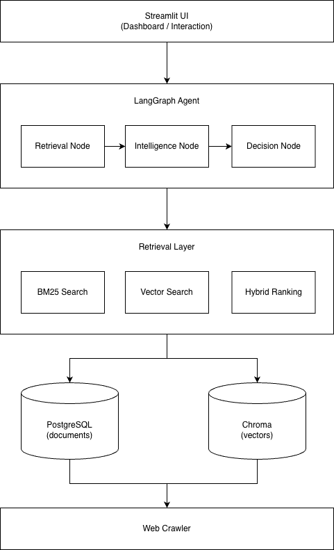
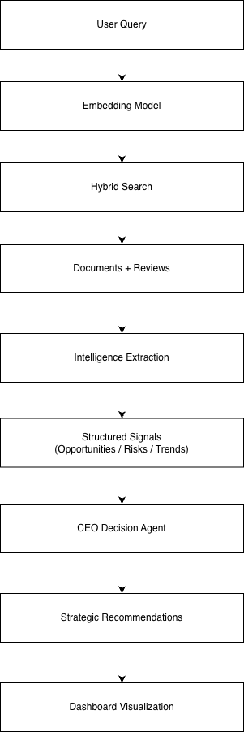
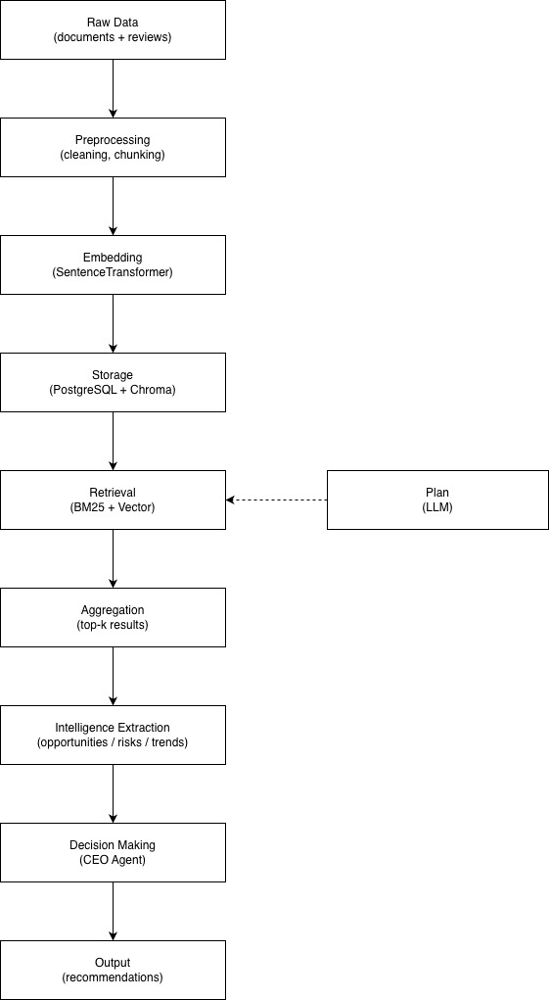

# AI CEO: Strategic Intelligence Agent

AI CEO is a Retrieval-Augmented Generation (RAG) and multi-agent system that gathers information from public business and financial sources to support intelligent analysis and decision making. It combines web crawlers, PostgreSQL, vector search, and large language models to build an extensible knowledge base for strategic insights.

---

## How to run the system

### Start Infrastructure Services

Start PostgreSQL and ChromaDB using Docker:

docker compose up -d

Ensure both services are running:

- PostgreSQL on port 5432
- ChromaDB on port 8000

### Start LLM Service

Start LLM by LM Studio on port 20000

### Prepare Databases

Run the SQL scripts:

- sql/migrations/001_create_sap_news_blog.sql
- sql/migrations/002_create_erp_today_news.sql
- sql/migrations/003_create_trustradius_sap_reviews.sql
- sql/migrations/004_create_documents.sql
- sql/migrations/005_create_reviews.sql
- sql/migrations/006_create_document_chunks.sql

### Prepare Data (if not already done)

Run the data processing pipeline:

- python ai_ceo/crawler/crawl_sap_news_blog.py
- python ai_ceo/crawler/crawl_erp_today_news.py
- python ai_ceo/crawler/crawl_trustradius_sap_reviews.py

Run the data processing pipeline:

- python ai_ceo/cleaning/build_data.py

(Data can also be restored by scripts in sql/data_backup)

Then generate embeddings:

- python ai_ceo/retrieval/embed_documents.py
- python ai_ceo/retrieval/embed_reviews.py

### Start the Dashboard

Run the Streamlit application:

./startup.sh

### Access the Dashboard

Open your browser and go to:

- http://localhost:8501

### Run Analysis
Enter a query in the sidebar (e.g., "SAP AI strategy")

Click Run Analysis

Navigate through the dashboard tabs to explore:

- Market intelligence
- Opportunities & risks
- Sentiment analysis
- Strategic recommendations

---

## Crawlers

The project currently includes three data crawlers for collecting public business and financial information.

- TOTAL: 141

| Source         | Type             | URL                                             | Description                                                                                                       |           Records |
|----------------|------------------|-------------------------------------------------|-------------------------------------------------------------------------------------------------------------------|------------------:|
| SAP News Blog  | official news    | https://news.microsoft.com/source/              | Crawls SAP official blog posts, including title, author, publication date, and full article content.              |            **60** |
| ERP Today News | industry news    | https://erp.today/category/erp-news/            | Crawls ERP Today News articles news, including title, author, publication date, and full article content.         |            **31** |
| Trust Radius   | customer reviews | https://www.trustradius.com/products/sap-analytics-cloud/reviews/all | Crawls TrustRadius reviews for SAP Analytics Cloud, including review title, reviewer name, publication date, rating, pros, and cons. |            **50** |

### Notes

* All crawlers store the collected data in PostgreSQL.
* Duplicate records are handled using database upsert logic.
* Network requests include retry handling and delays between requests to improve robustness.
* Article content is extracted from the corresponding web pages whenever applicable.
* The crawler framework is designed to be easily extended with additional news and blog sources.

---

## System Architecture

The system follows a layered architecture:

- Presentation Layer: Streamlit dashboard
- Orchestration Layer: LangGraph agent
- Retrieval Layer: Hybrid search (BM25 + vector)
- Data Layer: PostgreSQL and Chroma

---

## Data Flow

---

## Technology Stack

Frontend:
- Streamlit

Backend:
- Python
- LangGraph (Agent Orchestration)

Retrieval:
- BM25 (Gensim)
- Vector Search (ChromaDB)

Database:
- PostgreSQL

ML / AI:
- SentenceTransformers (Embedding)
- Local LLM (Gemma via OpenAI API)

Infrastructure:
- Docker (PostgreSQL, Chroma)

---

## Design Decisions

1. Hybrid Retrieval (BM25 + Vector)
   - Combines lexical and semantic search
   - Improves recall and precision

2. Separation of Documents and Reviews
   - Documents: factual information
   - Reviews: user sentiment
   - Enables balanced decision-making

3. LangGraph-based Pipeline
   - Provides modular and interpretable reasoning
   - Ensures deterministic execution flow

4. Local LLM Deployment
   - Reduces latency and dependency on external APIs
   - Enables full control over inference

5. Chunking Strategy
   - Improves retrieval granularity
   - Enhances embedding quality

---

## AI Pipeline

